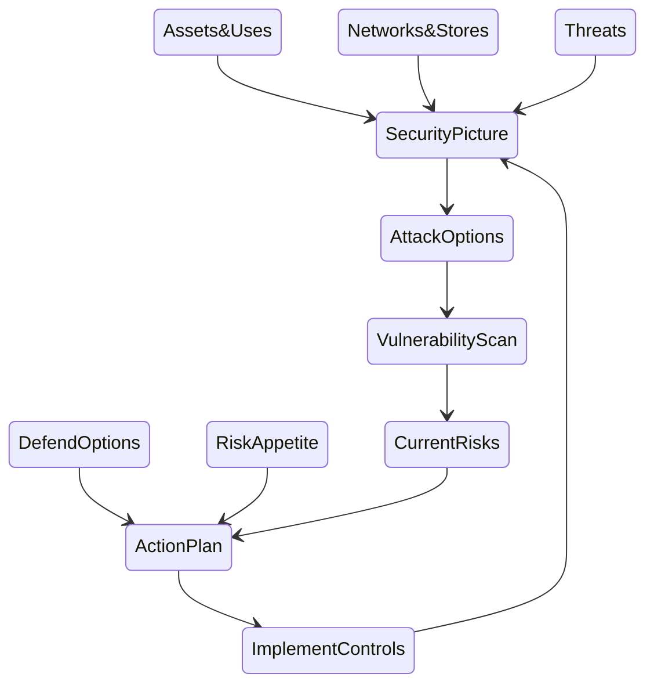

## Outline

Essentially we **identify** the **assets** that we want to protect and:

* what impact would there be if they were stolen (nicked), disabled or destroyed (bricked), or corrupted (tricked)
* where they are, how they move
* what the existing security is

We then look at what the **threats** are and how they might reach and affect the assets

This gives us the existing vulnerabilities and we can use these and the impact scales to calculate and register the **risks** 

We use this risk registry to prioritise the **security controls** for those assets that are particularly vulnerable to the relevant threats, and that have high impacts if compromised. 

Once these are implemented and tested, we can recalculate the risks until we are satisfied that the risks are acceptable.  

## Using the Playbook

The playbook essentially follows the process in the diagram above. We have tried to keep it reasonably clean, so we have extracted *why* we do things that way to separate pages.  

This is a systems approach; we have broken down the problem into different component problems that you can focus on and then assemble into the security picture. However bear in mind that each component, such as the Threat Assessment, cannot be done well in complete isolation so be aware of the bigger picture at all times.

[The Playbook](Playbook.md)
