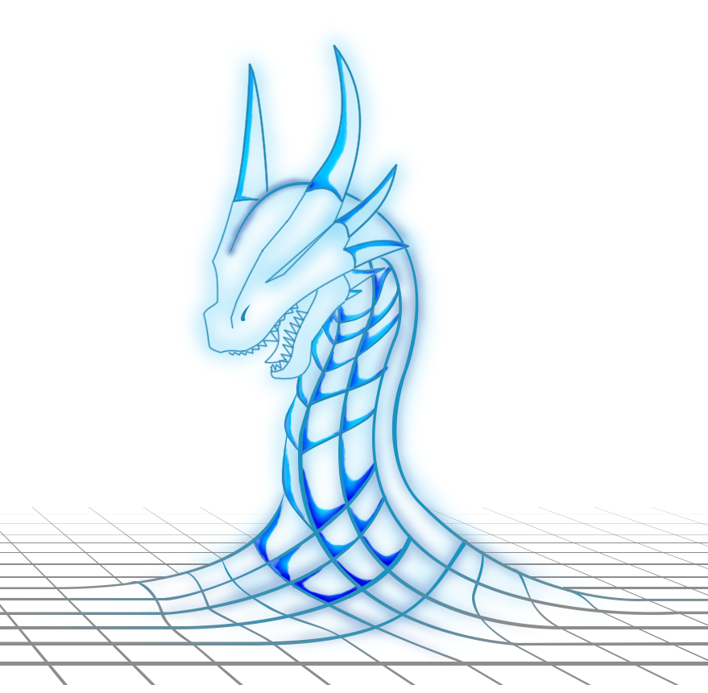

# The Playbook
 
## Overall Approach

* Assess the situation, by first identifying:
  * The **assets** that we will protect, how they are used, and what would be the impact if they are affected
  * The 'space', or the **networks**, that the assets are stored in and the routes they move around on
  * The **threats** that are interested in attacking our assets
* Put these together to see where these threats might access which assets through what parts of the network - our **security picture**. 
* Work out what areas need better defences, and in what ways so we don't accidentally shoot ourselves in the foot.
* Compare the  costs and benefits of the options, and select suitable ones to add. 

Once these new defences are included, or planned, then re-assess the situation.

Here is that approach in a diagram:

<pre class="mermaid">
stateDiagram
   Assets&Uses --> SecurityPicture
   Networks&Access --> SecurityPicture
   Threats --> SecurityPicture

   SecurityPicture --> CoursesOfAction
   CoursesOfAction --> AssessingTheRisks
   AssessingTheRisks --> CurrentRisks
   DefendOptions --> ActionPlan
   RiskAppetite --> ActionPlan
   CurrentRisks --> ActionPlan
   ActionPlan --> ImplementControls
   ImplementControls --> SecurityPicture
</pre>

We will go through each of these in more detail below, but essentially that's the playbook to follow. We strongly recommend going through it once quickly and scrappily to learn, and then again more carefully to be more thorough, and then again until it becomes routine and mostly automatic.

## Prepare

You will need:

* To be clear about **what you are assessing**. In the software world, we are typically developing a system to be used by someone else. We need therefore to assess the risks the *deployed* system has, but also the risks to the *development team*. These are two different assessments.
* A place to **register what assets you have where**. We have a starter spreadsheet for you to record onto, but your workplace may already have asset registers so it's worth seeing what already exists.
* Ways to **explore and map your networks**. To start with this can be diagrams of the main store and processing points and the links between them, or just 'zone' blobs, but at some point you will need to properly check what actual equipment is where and what the actual connections are between them. There are various tools for this and we will cover them later, but you will probably need to draw on technical expertise too.
* **Threat assessments**. Again we have a starter spreadsheet for you to use, but you will probably need to tailor it and add to it for your own specific situation.
* **A Risk Register**. Most projects should have this already, even if in some cases it is largely in people's heads. You will need to transfer your Cyber Security risk assessment to business terms.

## Understand the Situation

We look at the assets first because these shape everything else in the assessment

### Assets & Uses

Identify your assets and what they are used for. Estimate their security value: 

 * What would the impact be if they were affected by being nicked (stolen or copied), bricked (denied, destroyed, broken, lost), or tricked (corrupted in some misleading way).
 * Prioritise the more valuable ones - the ones that would have greater impact if they were affected. Skip ones that are less relevant, and in the first round even those that you don't understand properly. Be quick, coarse, and rough with your estimates rather than exact and late.  

| Asset                 | Uses                                                         | Nicked                                                       | Bricked                                | Tricked                                                      |
| --------------------- | ------------------------------------------------------------ | ------------------------------------------------------------ | -------------------------------------- | ------------------------------------------------------------ |
| What Thing...   | ..is used by who to do what? | If it is stolen then what can someone find out from it? | If you can't use it, what are you also unable to do? | What false information on it might lead to problems? |

By doing this we not only remind ourselves what is actually important to us, but we can start to score these to compare them, and so prioritise which ones to focus on.

Where possible we should use the same units - eg money - to compare them, but if we include people then we might also include time, physical harm, emotional pain, etc.

See [Assets Assessments](assess/Assets.md) for more detail, a starter [Asset Register][assets/AssetsRegister.ods], and this [explanation video](https://www.youtube.com/watch?v=afbq4GgeKDM&list=PLKjQAPJ7DIEpwAtzMKIRAiOrNvuk4qjWb&index=1&t=26s)

##### Home Example

For example in our home networks we will have sensitive personal information about our families on home laptops or phones, some valuable gaming devices, and probably access to our financial assets at a bank. For each of these consider what the impact would be if you didn't have it any more, or if someone got a copy of it, or somebody fiddled with it. [Read more](./examples/home/)

### Networks, Space and Access

Map out the space -  the computer networks - where our assets are located and moved through.  Include:

* Storage and processing points: phones, laptops, computers, USB sticks, SD cards. What assets are held on these?
* Links between them: how are your assets moved between devices? This should include how users get to access the assets on those devices; how is the information moved from device to user?
* What defences are already in place on each route to prevent unauthorised access?
* Include physical as well as virtual computer network locations
* Include areas that you don't control but your assets still exist in or move through.

This can be a very high level diagram to start with; don't worry about all the various detailed technical links.

See [Network Assessments](assess/Networks.md)  for more detail and this [explanation video](https://www.youtube.com/watch?v=KEDMR-ojlI8&list=PLKjQAPJ7DIEpwAtzMKIRAiOrNvuk4qjWb&index=2)

##### Home Example

We draw out each device in our house, and then draw a line between it and the router that it connects to, depending on whether it is wifi (orange) or cable (blue). [Read more](./examples/home/)

### Threats

For this playbook we focus on threat *actors*: people and groups that deliberately or accidentally compromise our assets. 

> Some risk assessment frameworks (such as NIST 800 3..) include natural threats such as earthquakes, but these can and should be managed in different ways; leave them out of this assessment. 

Threat actors have a range of capabilities and motivations, both generally and when applied to our specific space and assets. To start with, use a coarse score for each of these rather than listing technical skills, tools and goals:

| Threat Actor   | Capability | General Motivation | Specific Motivation |
| -------------- | ---------- | ------------------ | ------------------- |
| Script Kiddies | Low        | High               | Low                 |
| Competitors    | Medium     | Medium             | High                |
| ...            |            |                    |                     |

See [Threat Assessments](assess/Threats.md) for more details, a starter [Threat Actor Registry](assets/ThreatsRegister.ods) , and an [explanation video](https://www.youtube.com/watch?v=9Zwl-BxyUQg&list=PLKjQAPJ7DIEpwAtzMKIRAiOrNvuk4qjWb&index=3&t=63s).

##### Home Example

[Read more](./examples/home/)

### Security Picture

We now look at how *these* threats would navigate *this* network to have an effect on *these* assets.  

These are the **courses of action** that a threat actor can take to cause us harm.  

We can pick out: 

 * which parts of the **network** are particularly important to protect our **most** **valuable** **assets**. We can call these our **vital spaces**, and we can prioritise them by the **impact** of nicking, bricking or tricking the assets either stored in or moving through them. 
 * **Routes** between these **vital spaces** and our **threat actors**. These are the **attack vectors**. 

However, this gives us a large combination of possibilities: 

> Number of Threats x Number of Routes x Range of Impacts 

...and we will need to prioritise. 

##### Home Example

[Read more](./examples/home/)

### Assessing the Risks

We can use our assessments of threat actors, networks and asset impacts to prioritise which of these we need to work on first. The highest risks are those with the most **capable** and **motivated** threat actors able to reach the most **vital spaces**  using routes through the network that are the **least defended**. 

These are our high priority **vulnerabilities**; the easiest courses of action for these threat actors that would cause us the most harmful impacts. 

We can also eliminate particular combinations and possibly even threat actors. For example if you are building a standalone system that will not be connected to anything else, you can eliminate script kiddies *for the built system*; they may still be a threat to your development team.

We are left with all the other vulnerabilities, ie which courses of action do not have sufficiently good protection to deal with them. This is likely to be large. Look also for bottlenecks in the routes available to the threat actors and see what defences can be put in place. Otherwise, for the first passes, concentrate on the high priority vulnerabilities.

##### Home Example

[Read more](./examples/home/)

#### Trade Offs

It can be tempting to just slam defences in everywhere you can see a vulnerability. 

But defences have costs; you need to weight those costs against the impacts of assets being affected.  If the cost of defending an asset is greater than the impact of that asset being affected then the defence is self-defeating.  You will need to talk to your technical people to understand what defences will be appropriate for each vulnerability, what single defences might cover many vulnerabilities, and how much they will cost.

This might be operational rather than money; if you shut down your own people's ability to work, you essentially "self-brick" your own operations. 

You might even find examples of existing defences in place that cost more than the assets they now protect.

This is not clear cut. You might know the costs of defences reasonably well,  but these need to be weighed against the *likelihood* of threat actors successfully affecting  your assets combined with the *likely* impacts of those effects on those assets.  That uncertainty can make this tricky. In the first passes, you can use the indexes in the sheets we provided to calculate the trade-offs, but be wary of 'crap rigour'; use the indexes to guide you, do not treat them as rigorous. 

These trade-offs will give a list of '**residual risks**'; these are the risks still left over once we have considered the existing defences and which assets are not worth spending significant defences on.  

Convert these residual technical security risks into business security risks (usually in the form of business costs) and add them to the general project or company risk register. The risk owners look over all of these to decide if these are acceptable or not according to the business **risk appetite**, and to make a call on whether to continue operating even if some risks still require treating or transferring.  

##### Home Example

[Read more](./examples/home/)

#### Complex Attacks

For the first assessments you can focus on direct, simple attacks where the Threat Actor attempts to 'break in' and affect an asset using one technique.

In practice Threat Actors are likely to work more slowly and more piecemeal; they might attack the office network to steal some information about your developer network, then *use that* to persuade developers to reveal some information about the software used, then *use that* to insert some malware into an open-source software library being used. 

This complicates the Assets impacts and residual risks, because Threat Actors might attack low-impact assets to get information to reach high-impact assets.

While you can largely ignore this on the first pass, you should have a placeholder in your risk assessment to work out **attack chains** as **courses of action** that are **complex attacks** 

(Why do we suggest assessing the risks like this? See [our explanation](explain\WhySecurityPicture.md) )

### Security Action Plan

With our prioritised list of **vulnerabilities** we can consider options for defending them. 

Defences coarsely, consist of 'protect', 'detect' and 'respond' that correspond to the NIST CSF's sections:

* **Protect**: Prevent threat actors from accessing
* **Detect:** Monitor systems to tell when threat actors have penetrated into the system
* **Respond:** Eject threat actors, restore bricked or tricked systems, mitigate against nicked data. 

We can then use the asset layout over the network to show us *where* these protections should be applied. 

The protection measures are called '**controls**'. These might be physical, technical or adminstration

* **Physical Controls:** eg fences, walls, locked doors, swipe-card access
* **Technical Controls:** eg password-protected access, phone authenticators, fingerprint or retinal scanners.
* **Administration Controls:** eg Security Clearances, references, training, behaviours

##### Home Example

[Read more](./examples/home/)

#### Communicating your plan

Your action plan needs to go to your business team who will be approving the financial spend. You have now both the costs and the risks, so all the information is here that they need.

It will then need to go to your technical team to implement the right controls. You should have the **attack vectors**  from your Security Picture, so the technical team will understand where to place the right controls to defeat the expected attacks. Ideally the team who will do this are the same people you have asked about the costs of the defences, so they are already aware and informed. 

##### Home Example

[Read more](./examples/home/)

#### 

