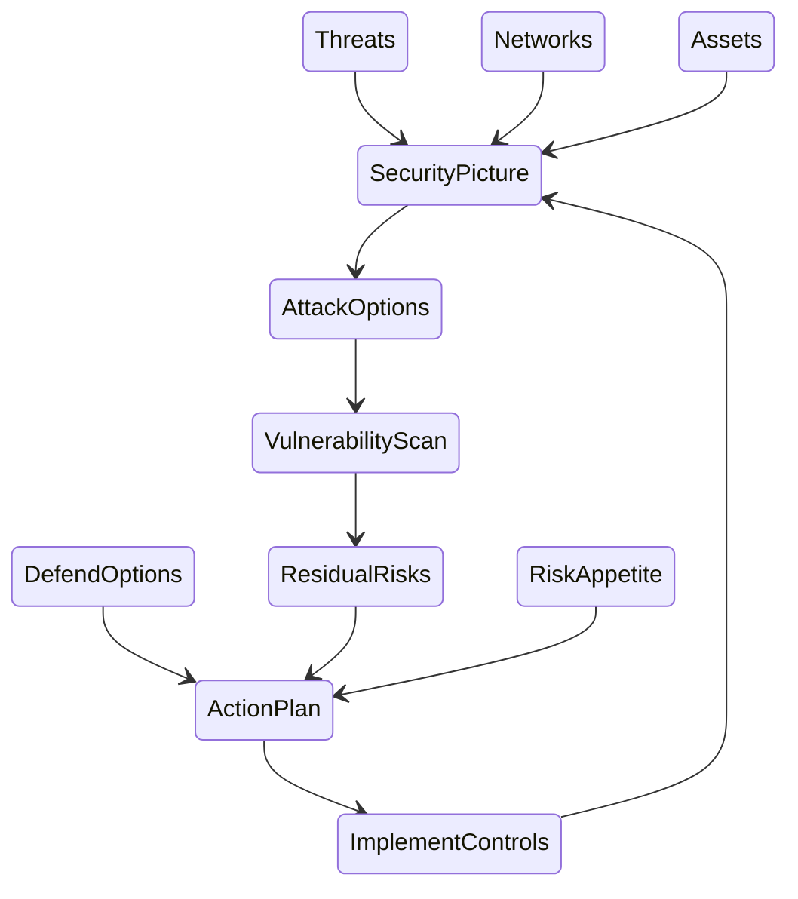

# The Playbook

## Overall Approach

We will examine three aspects of the security situation:
* Assets 
* Networks
* Threats 

...to build a picture of what is going on, and what could plausibly happen.

We use that list of possibilities to define a list of new or improved defences.

The costs and benefits of these will be judged, and suitable ones selected to be implemented. 

Once included in the new picture, the situation can be reassessed. We strongly recommend doing this once quickly and scrappily to learn, and then again more carefully to be more thorough.

Here is that approach in a diagram:

## Assessing the Risk: Understand the Situation

It is tempting to start with the threats, but to assess risk we should start with what matters to us in the first place and what would be the effect on us if something were to happen to them.

Once we know what these are - and where they are - we can target our threat assessment suitably, rather than trying to understand all possible threats everywhere.  

### Assets & Uses

Identify your valuable assets and their security value. The value attached to each of these should be measured against the impact of each being compromised, whether it is nicked (stolen or copied), bricked (denied, destroyed, broken, lost), or tricked (corrupted in some misleading way). 

For example in our home/office networks we will have sensitive company information on a company laptop, perhaps personal information about our families on a hard disk, some valuable gaming devices, and probably access to our financial assets at a bank. For each of these consider what the impact would be if you didn't have it any more, or if someone got a copy of it, or somebody fiddled with it.

In some cases, especially in the first quick pass, just skip entries that don't make much sense or are not likely relevant. For example you might have an old gaming device that you like but use rarely, so if it is bricked or nicked then in practice the impact will be small; skip it for now.

| Asset                 | Nicked                                                       | Bricked                                | Tricked                                                      |
| --------------------- | ------------------------------------------------------------ | -------------------------------------- | ------------------------------------------------------------ |
| Company Laptop        | Our competitors gain advantage. I lose a few days work to get it replaced | I lose a few days work get it replaced | n/a                                                          |
| Financial information | Lost money                                                   | Cannot make payments for a few days    | Make payments to the wrong people; lost money                |
| School Reports        | Jonny's reputation reduced                                   | We can't track Jonny's progress        | Jonny's hacked the school sharepoint again. Four points to huffleslyth |
| PlayXBoy 5000Kz       | I can't play games                                           | I can't play games                     | n/a                                                          |

By doing this we not only remind ourselves what is actually important to us, but we can start to score these to compare them, and so prioritise which ones to focus on. Where possible we should use the same units - eg money - to make them directly comparable, but you might have to use a few (money, time, physical harm, emotional pain, etc).

What should also drop out of this impact assessment is who uses these assets; ie who will be impacted by each of these effects. 

See [Assets & Impacts](assess/AssetsAndImpacts.md) for more detail

### Networks, Space and Uses

Next we map out the space -  the computer networks - where our assets are located and moved through.  We should include not just the computer networks we can control (our areas of responsibility) but also the areas that affect us such as internet links to the bank (areas of interest). This includes physical locations, computer equipment, cloud services, the people and all the communication links - the channels - between them.

This can be a very high level diagram to start with; don't worry about all the various detailed technical links:

[home network example]

We also need to include where the users are in the network, and what assets they access using what channel.

See [Space & Users](assess/SpaceAndUsers.md)  for more detail

### Threats

With the assets located in the network, we now look for the threats that matter to *these* assets in *these* spaces. 

For this playbook we focus on threat actors: people and groups that deliberately or accidentally compromise our assets.  Some risk assessment frameworks (such as NIST) include natural threats such as earthquakes, but these can and should be managed in different ways. Leave them out of this assessment. 

Threat actors have a range of capabilities and motivations, both generally and when applied to our specific space and assets. To start with we can use a coarse score for each of these rather than listing technical skills, tools or individual goals.

| Threat Actor   | Capability | General Motivation | Specific Motivation |
| -------------- | ---------- | ------------------ | ------------------- |
| Script Kiddies | Low        | High               | Low                 |
| Competitors    | Medium     | Medium             | High                |
| ...            |            |                    |                     |
|                |            |                    |                     |

See [Threats & Attacks](assess/ThreatsAndAttacks.md) and a starter threat actor list.

### Security Picture

We combine assets and threats onto our network diagram, laying out the assets in the space and what channels the threats may use to reach them.  These are their attack options.

[example]

We can include any of the security controls (protection measures) that are already in place.

[example]

From this we can see what vulnerabilities exist, ie which attack options do not have sufficiently good protection to deal with them. 

[example]

We can now can pick out: 
 * which parts of the estate are particularly important to protect our valuable assets. We can call this our **vital space**. 
 * Routes between these vital spaces and our threat actors. These are our **attack vectors**. 

(Why do we do things this way? See [our explanation](explain\WhySecurityPicture.md) )

### Risk Assessment

Use this vulnerability list, combined with the impacts scores for the assets, to show where we are exposed and so which assets we need to focus new protections on.  It may also show us where security is over applied; ie where expensive (time or cost) security measures are in place to protect low-value assets.

These impact scores, and associated insufficient security measures, give us the registry of residual technical security risks. 

[example]

The residual technical security risks are converted into business security risks and added to all the other project risks. The risk owners look over all of these to decide if these are acceptable or not according to the business risk appetite, and to make a call on whether to operate even if some risks still require treating or transferring.  

### Security Action Plan

With our prioritised list of assets and places to protect, we can consider options for defending them. These are, coarsely, 'protect', 'detect' and 'respond' that correspond to the NIST CSF's sections with these names. 

We can then use the asset layout to show us *where* the protections should be applied. 

## Protect & Monitor  

Physical Controls:

Technical Controls:
Protect
  Monitor

  ---> Vulnerabilities --> Residual Risks

Adminsitrative Controls:
  Train
   Monitor

## Communicating

