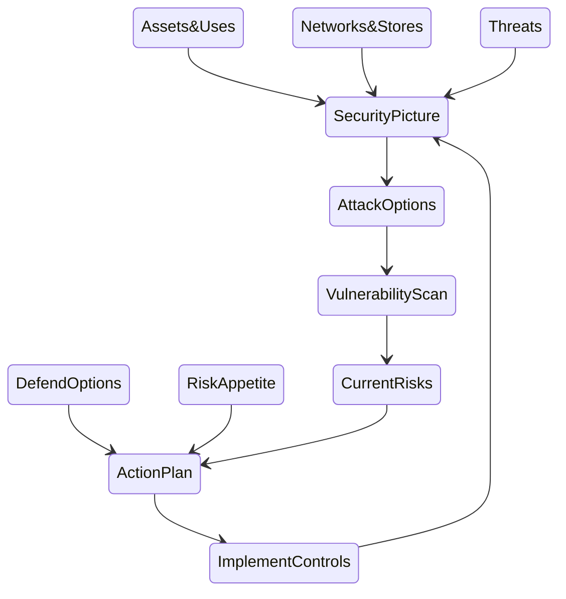

# The Playbook

## Overall Approach

* Assess the situation, by first identifying:
  * The assets that we will protect, how they are used, and what would be the impact if they are affected
  * The 'space', or the networks, that the assets are stored in and the routes they move around on
  * The threats that are interested in attacking our assets
* Put these together to see where these threats might access which assets through what parts of the network. 
* Work out what areas need better defences, and in what ways so we don't accidentally shoot ourselves in the foot.
* Compare the  costs and benefits of the options, and select suitable ones to add. 

Once these new defences are included, or planned, then re-assess the situation.

Here is that approach in a diagram:

We will go through each of these in more detail below, but essentially that's the playbook to follow. We strongly recommend going through it once quickly and scrappily to learn, and then again more carefully to be more thorough, and then again until it becomes routine and mostly automatic.

## Prepare

You will need:

* To be clear about **what you are assessing**. In the software world, we are typically developing a system to be used by someone else. We need therefore to assess the risks the *deployed* system has, but also the risks to the *development team*. These are two different assessments.
* A place to **register what assets you have where**. We have a starter spreadsheet for you to record onto, but your workplace may already have asset registers so it's worth seeing what already exists.
* Ways to **explore and map your networks**. To start with this can be diagrams of the main store and processing points and the links between them, or just 'zone' blobs, but at some point you will need to properly check what actual equipment is where and what the actual connections are between them. There are various tools for this and we will cover them later, but you will probably need to draw on technical expertise too.
* **Threat assessments**. Again we have a starter spreadsheet for you to use, but you will probably need to tailor it and add to it for your own specific situation.
* **A Risk Register**. Most projects should have this already, even if in some cases it is largely in people's heads. You will need to transfer your Cyber Security risk assessment to business terms.

## Understand the Situation

We look at the assets first because these shape everything else in the assessment

### Assets & Uses

Identify your assets and what they are used for. Estimate their security value: 

 * What would the impact be if they were affected by being nicked (stolen or copied), bricked (denied, destroyed, broken, lost), or tricked (corrupted in some misleading way).
 * Prioritise the more valuable ones - the ones that would have greater impact if they were affected. Skip ones that are less relevant, and in the first round even those that you don't understand properly. Be quick, coarse, and rough with your estimates rather than exact and late.  

| Asset                 | Uses                                                         | Nicked                                                       | Bricked                                | Tricked                                                      |
| --------------------- | ------------------------------------------------------------ | ------------------------------------------------------------ | -------------------------------------- | ------------------------------------------------------------ |
| What Thing...   | ..is used by who to do what? | If it is stolen then what can someone find out from it? | If you can't use it, what are you also unable to do? | What false information on it might lead to problems? |

By doing this we not only remind ourselves what is actually important to us, but we can start to score these to compare them, and so prioritise which ones to focus on.

Where possible we should use the same units - eg money - to compare them, but if we include people then we might also include time, physical harm, emotional pain, etc.

See [Assets Assessments](assess/Assets.md) for more detail, a starter Asset Register, and this [explanation video](https://www.youtube.com/watch?v=afbq4GgeKDM&list=PLKjQAPJ7DIEpwAtzMKIRAiOrNvuk4qjWb&index=1&t=26s)

##### Home Example

For example in our home networks we will have sensitive personal information about our families on home laptops or phones, some valuable gaming devices, and probably access to our financial assets at a bank. For each of these consider what the impact would be if you didn't have it any more, or if someone got a copy of it, or somebody fiddled with it.  

| Asset                 | Uses                                                         | Nicked                                                       | Bricked                                | Tricked                                                      |
| --------------------- | ------------------------------------------------------------ | ------------------------------------------------------------ | -------------------------------------- | ------------------------------------------------------------ |
| Work Laptops          | Arthur uses for work in the living room, Betty in the spare bedroom | Our competitors gain advantage. I lose a few days work to get it replaced | I lose a few days work get it replaced | Phishing attack means I send some                            |
| Financial information | Arthur and Betty use phone apps to manage accounts           | Lost money                                                   | Cannot make payments for a few days    | Make payments to the wrong people; lost money                |
| School Reports        | School and parent use to communicate Jonny's lack of progress | Jonny's reputation reduced                                   | We can't track Jonny's progress        | Jonny's hacked the school sharepoint again. Four points to huffleslyth |
| PlayXBoy 5000Kz       | Arthur plays games                                           | Arthur can't play games                                      | No one can play games                  | Arthur thinks he's good at games                             |

See more on our [home worked example](../examples/homenet)

### Networks, Space and Access

Map out the space -  the computer networks - where our assets are located and moved through.  Include:

* Storage and processing points: phones, laptops, computers, USB sticks, SD cards. What assets are held on these?
* Links between them: how are your assets moved between devices? This should include how users get to access the assets on those devices; how is the information moved from device to user?
* What defences are already in place on each route to prevent unauthorised access?
* Include physical as well as virtual computer network locations
* Include areas that you don't control but your assets still exist in or move through.

This can be a very high level diagram to start with; don't worry about all the various detailed technical links.

See [Network Assessments](assess/Networks.md)  for more detail and this [explanation video](https://www.youtube.com/watch?v=KEDMR-ojlI8&list=PLKjQAPJ7DIEpwAtzMKIRAiOrNvuk4qjWb&index=2)

##### Home Example

[diagram]

See also our [Home worked example](./assets/homenet)

### Threats

For this playbook we focus on threat *actors*: people and groups that deliberately or accidentally compromise our assets.  Some risk assessment frameworks (such as NIST 800 3..) include natural threats such as earthquakes, but these can and should be managed in different ways. Leave them out of this assessment. 

Threat actors have a range of capabilities and motivations, both generally and when applied to our specific space and assets. To start with use a coarse score for each of these rather than listing technical skills, tools or individual goals.

| Threat Actor   | Capability | General Motivation | Specific Motivation |
| -------------- | ---------- | ------------------ | ------------------- |
| Script Kiddies | Low        | High               | Low                 |
| Competitors    | Medium     | Medium             | High                |
| ...            |            |                    |                     |
|                |            |                    |                     |

See [Threat Assessments](assess/Threats.md) for more details, a starter Threat Actor list, and an [explanation video](https://www.youtube.com/watch?v=9Zwl-BxyUQg&list=PLKjQAPJ7DIEpwAtzMKIRAiOrNvuk4qjWb&index=3&t=63s).

### Security Picture

We now look at how *these* threats would navigate *this* network to have an effect on *these* assets.  

These are the **courses of action** that a threat actor can take to cause us harm.  

We can  pick out: 

 * which parts of the **network** are particularly important to protect our **most** **valuable** **assets**. We can call these our **vital spaces**, and we can prioritise them by the impact of nicking, bricking or tricking the assets stored or moving through those spaces. 
 * Routes between these vital spaces and our threat actors. These are the **attack vectors**. 

[example]

However, this gives us a large combination: threats x routes x impacts. 

### Assessing the Risks

We can use our assessments of threat actors, networks and asset impacts to prioritise which of these we need to work on first. The highest risks are those with the most **capable** and **motivated** threat actors able to reach the most **vital spaces**  using routes through the network that are the **least defended**. 

These are our high priority **vulnerabilities**; the easiest courses of action for these threat actors that would cause us the most harmful impacts. 

We can also eliminate particular combinations and possibly even threat actors. For example if you are building a standalone system that will not be connected to anything else, you can eliminate script kiddies *for the built system*; they may still be a threat to your development team.

[example]

We are left with all the other vulnerabilities, ie which courses of action do not have sufficiently good protection to deal with them. This is likely to be large. Look also for bottlenecks in the routes available to the threat actors and see what defences can be put in place. Otherwise, for the first passes, concentrate on the high priority vulnerabilities.

##### Trade Offs

It can be tempting to just slam defences in everywhere you can see a vulnerability. 

But defences have costs; you need to weight those costs against the impacts of assets being affected.  If the cost of defending an asset is greater than the impact of that asset being affected then the defence is self-defeating. 

This might be operational rather than money; if you shut down your own people's ability to work, you essentially "self-brick" your own operations. 

You might even find examples of existing defences in place that cost more than the assets they now protect.

This is not clear cut. You might know the costs of defences reasonably well,  but these need to be weighed against the *likelihood* of threat actors successfully affecting  your assets combined with the *likely* impacts of those effects on those assets.  That uncertainty can make this tricky. In the first passes, you can use the indexes in the sheets we provided to calculate the trade-offs, but be wary of 'crap rigour'; use the indexes to guide you, do not treat them as rigorous. 

##### Complications

Complex attacks. Cyber can be slow and piecemeal. 

(Why do we do things this way? See [our explanation](explain\WhySecurityPicture.md) )

##### Business Risks

These impact scores, and associated insufficient security measures, give us the registry of residual technical security risks. 

[example]

The residual technical security risks are converted into business security risks and added to all the other project risks. The risk owners look over all of these to decide if these are acceptable or not according to the business risk appetite, and to make a call on whether to operate even if some risks still require treating or transferring.  

### Security Action Plan

With our prioritised list of assets and places to protect, we can consider options for defending them. These are, coarsely, 'protect', 'detect' and 'respond' that correspond to the NIST CSF's sections with these names. 

We can then use the asset layout to show us *where* the protections should be applied. 

Physical Controls:

Technical Controls:
Protect
  Monitor

  ---> Vulnerabilities --> Residual Risks

Adminsitrative Controls:
  Train
   Monitor

#### Communicating your plan

