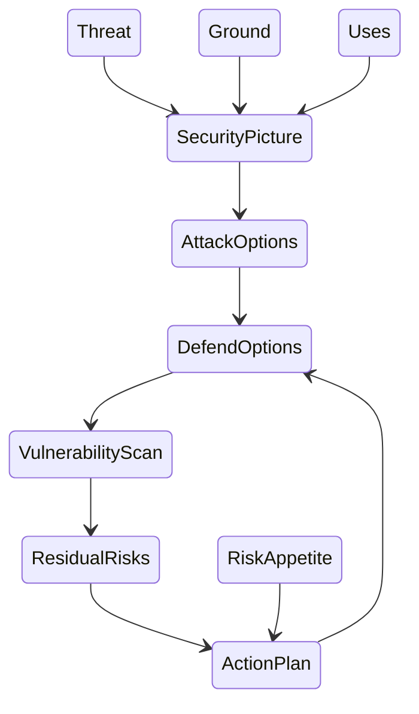

# Secure By Design Playbooks

This is a guide, with supporting material, to help you **assess security risks** for your small to medium size IT project.  It is intended for both technical and **non-technical staff**, at least during the early iterations, to help you **understand the interplay of risk costs and benefits**.

Semi-rigid checklist of controls or mitigations (such as [NCSC's Cyber Essentials](https://www.ncsc.gov.uk/cyberessentials/)) can be useful, but in unusual systems and circumstances such checklists can cause more harm than good.  The approach given here will show you how to rigorously approach security, with the right artefacts to engage with your security experts and auditors. 

In particular this playbook will help you comply with the UK government's [Secure By Design](https://www.security.gov.uk/policy-and-guidance/secure-by-design/), and is based on [NIST's Cyber Security Framework](https://www.nist.gov/cyberframework) and [Risk Management Framework](https://csrc.nist.gov/projects/risk-management/about-rmf).

We have provided [some examples here](./examples/).

## Quick Start

Want to just get started? Go straight to the [Quick Start Guide](QuickStart.md) or even just start the [Playbook](Playbook.md)

## Background 

[Why SbD?](about/WhySbD.md)  Security is already designed into most systems; why do we need a concept called 'Secure By Design'? 

[Why this playbook?](about/WhyPlaybook.md)  What this gives you on top of the existing cyber security frameworks

## Managing your Assessment

[Spirals not Cycles: Managing your assessments](./manage/SpiralNotCycle.md): Iterate - do it quickly and then again slowly, and then again at whatever detail you need. 

[Security Terms and Concepts](./explain/TermsAndConcepts.md):  The process is outlined here with the terms used in the playbook, along with some other commonly used ones so you can see how they relate. 

## Outline

Essentially we **identify** the **assets** that we want to protect, where they are, what the existing security is, what the threats are, and calculate from these the natural **risks**.

We then use this risk registry to prioritise the **security controls** for those assets that are particularly vulnerable to the relevant threats, and that have high impacts if compromised. 

Once these are implemented and tested, we can recalculate the risks until we are satisfied that the risks are acceptable.  

## Using the Playbook

The playbook essentially follows the process in the diagram above. We have tried to keep it reasonably clean, so we have extracted *why* we do things that way to separate pages.  

This is a systems approach; we have broken down the problem into different component problems that you can focus on and then assemble into the security picture. However bear in mind that each component, such as the Threat Assessment, cannot be done well in complete isolation so be aware of the bigger picture at all times.

[The Playbook](Playbook.md)

## Adding to this Project

Help us improve: what terms here do you find alien, what would you use? What analogies or stories might you bring to help explain some concepts?

[How to contribute](special/Contribute.md)

  Specialist Themes
      * Command Posts
            * Software Development Teams

## Related

https://www.security.gov.uk/policy-and-guidance/secure-by-design/policy/

[GovAssure](https://www.security.gov.uk/policy-and-guidance/govassure/)

[References](about/References.md)
