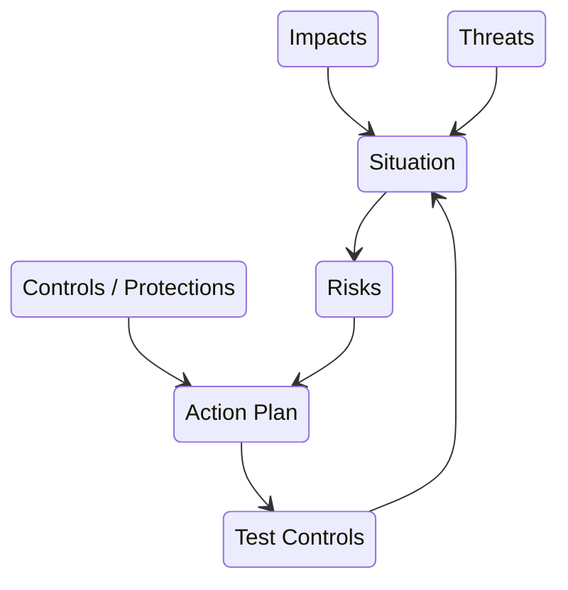

# Why Secure By Design?

You can read the UK Government's intent on their [Secure By Design](https://www.security.gov.uk/policy-and-guidance/secure-by-design/) page. This page talks through why we - engineers and managers on the supplier side - also prefer this approach. 

[Video - base on SbD is Not Accreditation]

## Accreditation: The Past Evil

The UK Government approach to assuring quality was to submit an IT system to 'accreditors' to provide the 'Authority To Operate' - or not.  The MoD for example had 'JSP604' which described what needed to be submitted to whom.  This included security, and the accreditors needed to 'sign off' that the system was suitably secure for the material it held or processed. Naturally, since they were taking responsibility for the security, they needed to study and understand these often complex systems - built by other people - before being able to assess them.  

Since the accreditors time was highly contested, this approval tended to delay IT system delivery, and discouraged flexibility or change. In particularly bad cases an IT system would first be built, *then* submitted to an 'accreditation' process that might take months or even years if changes were required. Technical staff on the original project either had to be kept engaged or called back. On top of the expense and calendar delays, changes after accreditation were discouraged as they would need to be submitted for approval too. 

There are benefits to this approach - independent scrutiny for one - and if managed properly with the accreditors involved from the start, it can be effective. However the churn of staff in the accreditor pool, and the high demand for their time, can make such integration difficult or impossible. 

## Checklists: An easy stop-gap

You can use lists of 'security controls' (protections) such as [NCSC's Cyber Essentials](https://www.ncsc.gov.uk/cyberessentials/) to ensure you have a foundation level of security.  Similarly there are 'best practices' that your technical staff will probably automatically implement, such as personal login accounts with tailored access to different parts of the systems (known as Role-Based Access Control).

These are essentially ready-made playbooks for common situations. NCSC's cyber essentials for example is an excellent playbook for your office and developer networks. 

However applying checklists only tell you whether your system is compliant or not. There is no real way of trading the cost of complying with the risk of not complying - or partly complying. They are not suitable for unusual situations.

## Secure By Design: The Shiny New Good

This new approach is to build IT security into the *project* design, not just the technical implementation. **Security is to be treated just like any other set of risks, and managed in the same way**. 

By framing security risks as business risks, the project managers or risk owners can evaluate the costs and benefits of reducing  - or even increasing - those risks within the scope of the project. Decisions about what security risks can be tolerated and which need to be mitigated, or controlled, are made along with all the other risks. Managers can - and should - still use external accreditors to help understand the risks and what can be done about them, but they no longer need to rely on them.

The 'end state' here is not a security-specific accreditation, but a list of residual risks within the general project residual risks that would include safety, finance, and so on.  As the systems develop and change, those risks are updated accordingly. 

## What SbD is and isn’t

By itself Secure By Design is an aspiration, or approach, to manage security through the project's risk registry. However we also need a way of calculating those risks; in this case of understanding the **threats** to the various **assets**, the **impacts** of those assets being compromised, and the **reduction in risk** when controls are implemented.

Secure By Design does not include this detail; and that's [why this playbook](WhyPlaybook.md). 

