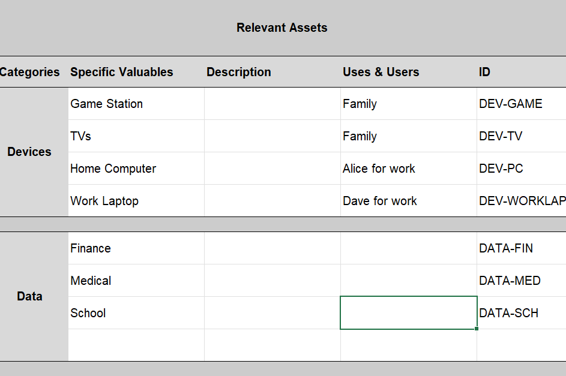
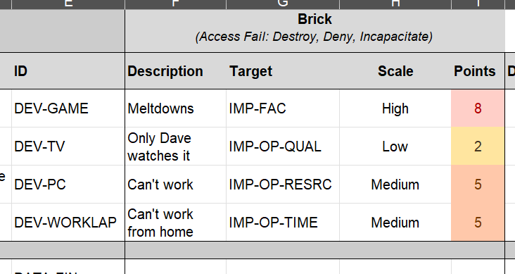

# Guide to the Playbook Assets Register

This is available as the original [Google Sheet](https://docs.google.com/spreadsheets/d/1YTQhJwKRkcZ8dpORtiHov0FCh3IHVTsWt-inOh3JeWU) developed by Holly, and as an [Excel Sheet](AssetsRegister.xlsx) maintained here.

### Identifying the Assets

On the left you should list the things that you believe are valuable. The example pre-entered in the sheet is for a simple home setup: 

You don't have to list every single device; feel free to group similar ones or those with similar uses. 

Include who uses the asset for what, to help fill in the impact table to the right in a moment. 

Give each one an "ID" so that you can refer to it from other documents later. 

> [!TIP]
>
> Make the identifying "ID" a short string (eg "DEV-GAME"), rather than a serial number, to make it easier for people to remember what they are when they read them in later documents. 

### Impacts

For each device think about what would happen if it was bricked, nicked, or tricked:

Write some quick notes about what the impact would be; if there are several impacts then you can create another line for the same asset, but again at least to start with keep this rough and broad.

> [!TIP]
>
> Trying to work out all the possible things that could happen if something is broken, stolen or modified can be a long, mentally challenging task.  Don't try and do it all here at once; pick the most obviously serious impacts and you can come back and fill in on the next iterations.

The **Impact Target** is optional, but it helps you work out **what** or **who** is going to be impacted by the device being affected.  A hacker might brick your company website, but the **impact** we are worried about is on the reputation of the business or lost sales. This drop-down picklist is from the 'Impact Target' worksheet (see the bottom tabs) where you can see what each one means. This is modified from the standard one in the [NIST Risk Assessment Guide](./about/), but this is also very broad and largely dedicated to large or national risk assessments, so feel free to delete irrelevant ones or add new ones.

Select a rough **Impact Scale** from a drop down. Again this is a standard one from the [NIST Risk Assessment Guide](./about/) and is on the 'Impact Scale' sheet where you can see what each one means.

### Total Impact

Once you have been through the Nick, Brick and Trick entries, you will see on the end an 'average' and 'worst' evaluation of the scores. You can use these to quickly prioritise which assets could have the worst impacts, and so might need the most immediate protections.

### Double the Trouble

If you are assessing the risk for a business creating a product then you might need two sheets: one for the developers and one for the product in use. 

This is particularly relevant to software developers; the developing team will need a risk assessment, and the deployed software will need one.

