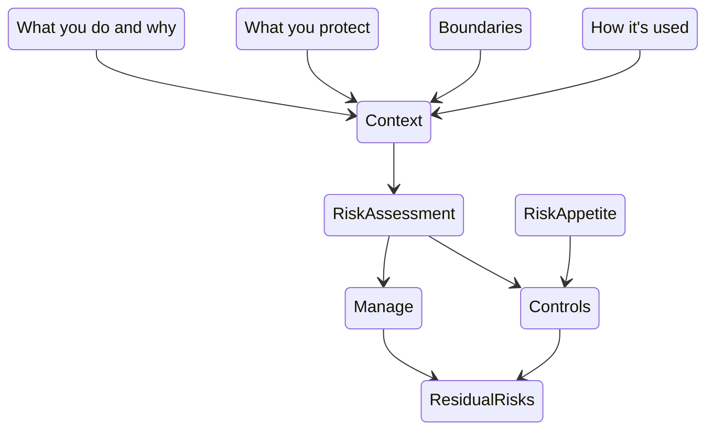
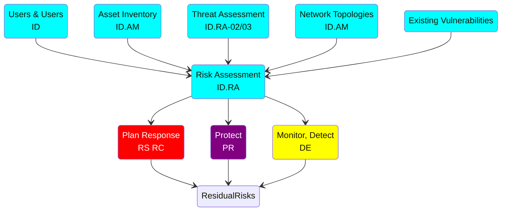
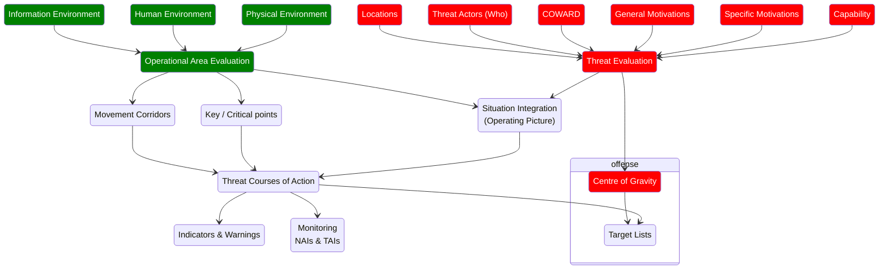

# Behind the Scenes: The Security Picture

The part of the playbook where we assemble the security picture is a mashup of NIST CSF, RMF, 'traditional' security analysis and military assessments.  Why did we do it this way?

Breaking it down into manageable chunks helps us to take apart the complex problem, and then reassemble the chunks for a specific situation - the one we are wanting to secure.

The cyber security frameworks we have selected don't tend to have the useful step-by-step detail that helps us to create the right chunks.  There is such a process in military ground assessments which we can borrow from; while ‘cyberspace’ might have a different form to the real world ground, there are still many similar aspects  that we can use.  

## UK Gov's Secure By Design

The Secure By Design page provide a list of questions to answer that are overlaid on whatever framework you use, it's not a process in itself although we can derive something like this:

## NIST Cyber Security Framework

The NIST CSF is also essentially a list of lists, organised as high level functions with various categories and subcategories:

<i>The implied NIST CSF process with reference identifiers to the framework topics.</i>

While this lists a number of documents to produced, there is little to no support in relating them to each other, or combining them into the Risk Assessment.

## The Military Approach

There are some similarities between military tactical assessments and cyber security assessments. Both look at the space we operate in (the 'ground' for the Army) and the adversary to derive what the situation is that the military force is facing. 

This approach gives us a more clearly defined way of combining the various inputs described above, but it does not include the friendly force picture or what we are protecting and why:

## The SbD Playbook Process

Our approach combines the above in the context of information system security. It includes an assessment of what we are protecting and why. It should give you some ways to understand how we integrate the various lists. And finally we have tried to make the terminology reasonably clear for business users, so that our technical risks can be translated into business ones reasonably easily. 

See the Playbook

