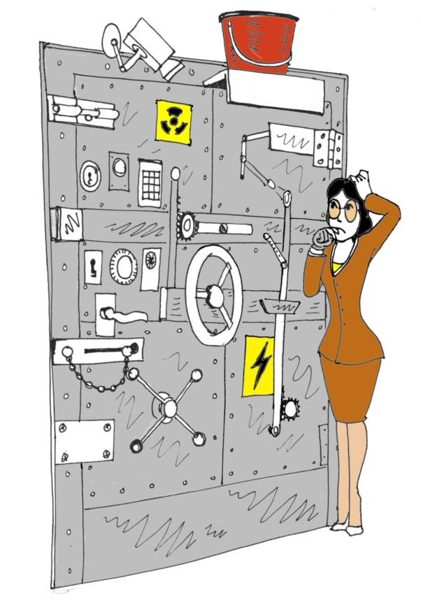

# Quick-Start: Defence Options

Now you have a prioritised list of **vulnerabilities**, you can consider options for **defending** them. 

Protection measures are called '**controls**' (because they 'control risk'). We typically break them down into: 

* **Physical Controls:** fences, walls, locked doors, swipe-card access
* **Technical Controls:** password-protected logins, phone authenticators, fingerprint or retinal scanners, firewalls.
* **Administration Controls:** providing warnings, changing people's behaviours, checking references for trustworthiness, security clearances, 

Some of these may be obvious and some less so. If you have a technical team or advisor, you should definitely be talking to them at this stage to talk about what the options might be, and which are ones more secure, more expensive, more difficult to maintain or administer, and so on. 

---

[Back to Playbook](./Playbook.md)  ●  [Home Example](examples/Home.md#Defences)  ●  [Next: Quick-Start Risk Assessment](./AssessRisks.md)  ●  [Smarter Defences](../smart/Defences.md)

