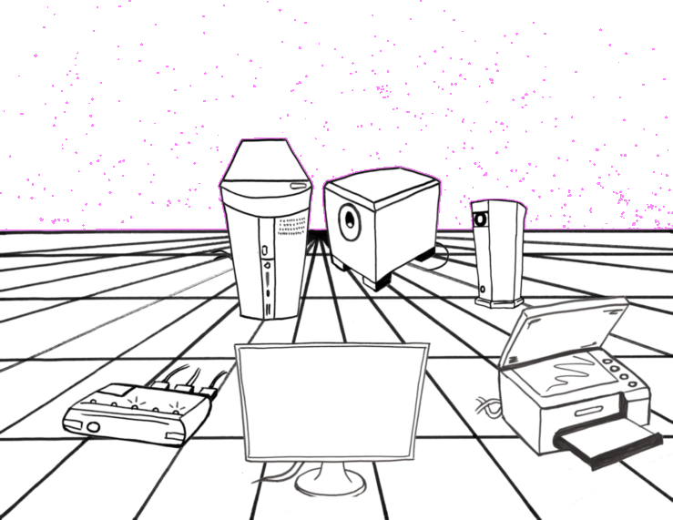
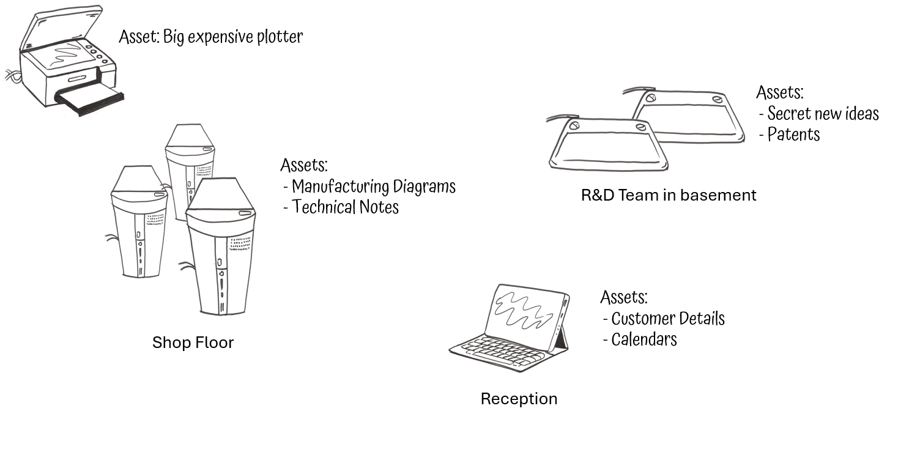

# Quick-Start: Cyber Space!

Draw out a linked diagram (a network) of what areas there are that have your valuable assets in them and the access routes, or communication links, between them. 

Draw on it where your assets are located or **stored** and the **routes** they move along.  

Include:

* **Stores** and **processing** devices: phones, laptops, computers, USB sticks, SD cards. 
  * What assets are held on these?

* Links that connect the devices that provide the **routes** your assets move along between devices.
  * Include how users get to access the assets on those devices; how does a user get to the asset? 

* Links that connect devices that *could* provide access to your assets. 
* **Defences** - security precautions - that are already in place.
* **Physical** as well as virtual computer network locations
* Areas that you **don't control** but your assets still exist in or move through.

This can be a very high level diagram, or even just a list of places, to start with; don't worry about all the various detailed technical links.

See [Smart Network Assessments](../smart/Networks.md)  for more detail and this [explanation video](https://www.youtube.com/watch?v=KEDMR-ojlI8&list=PLKjQAPJ7DIEpwAtzMKIRAiOrNvuk4qjWb&index=2)

#####  Home Example

[Read more](./examples/Home.md#Networks)

